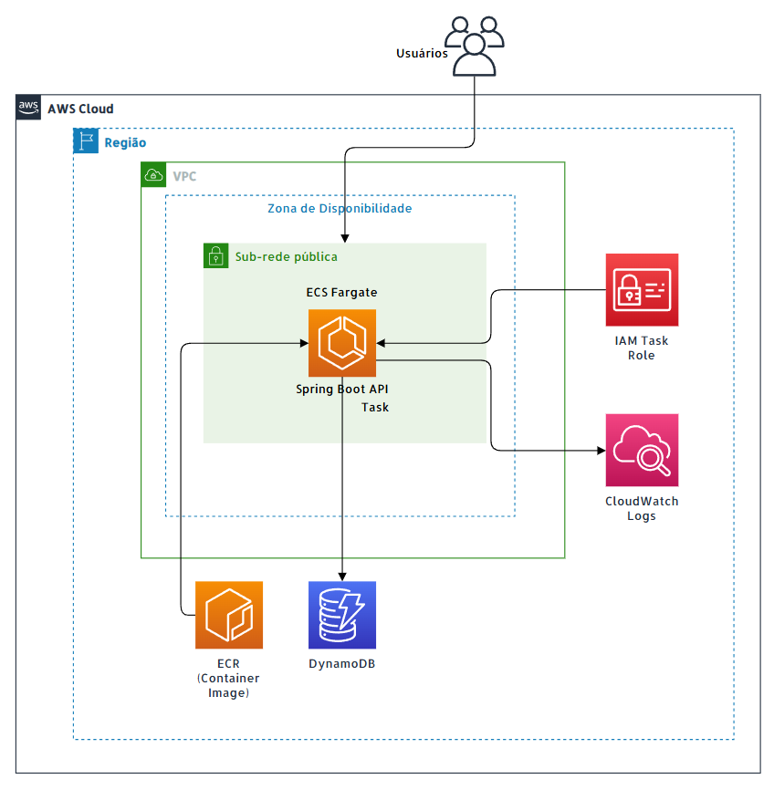
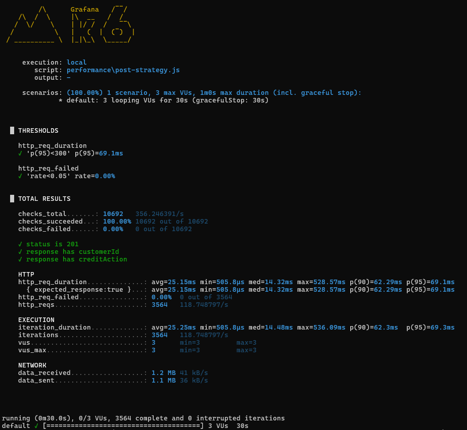
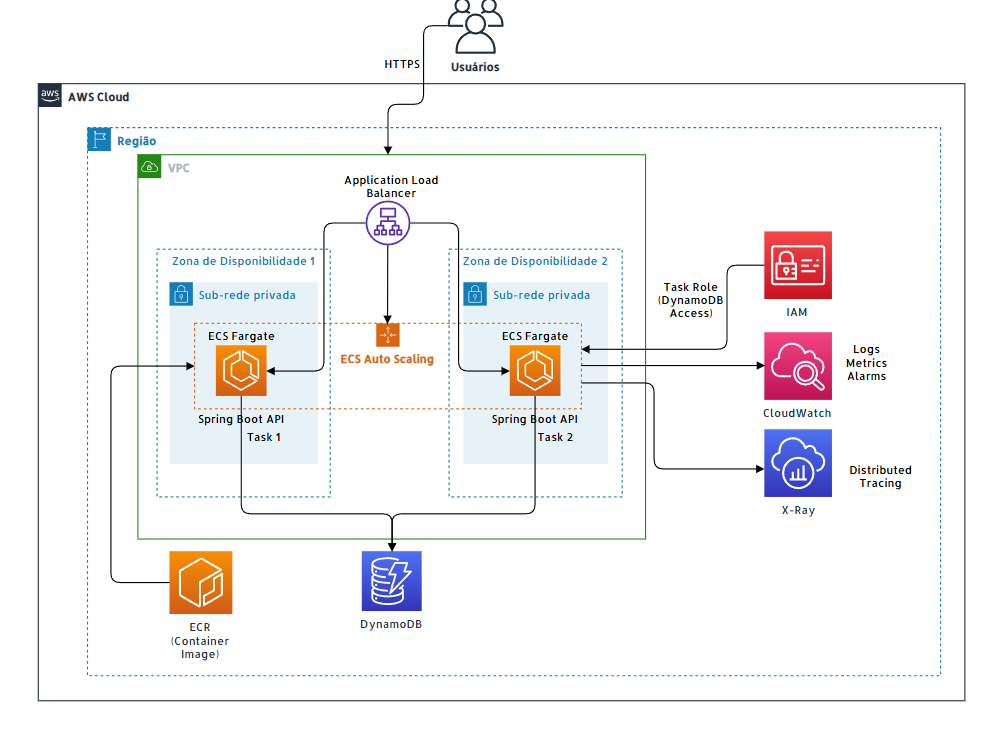

# Credit Recovery API

API REST para geração e consulta de estratégias de recuperação de crédito para clientes PJ.

A solução recebe informações cadastrais, financeiras e de crédito, processa esses dados por meio de um motor de regras fictícias e gera uma estratégia de recuperação personalizada. As estratégias geradas são disponibilizadas por API REST e persistidas no Amazon DynamoDB.

O projeto foi desenvolvido como um MVP e também demonstra aspectos de performance, observabilidade, conteinerização e uma proposta de arquitetura AWS escalável e resiliente para evolução em ambiente produtivo.

---

## Funcionalidades

A aplicação permite:

- Receber dados cadastrais e financeiros de clientes PJ.
- Gerar estratégias de recuperação de crédito.
- Definir ações de crédito.
- Definir canais de comunicação.
- Definir ações relacionadas a cartão.
- Definir envio para escritório parceiro.
- Definir notificações em canais digitais.
- Persistir estratégias no Amazon DynamoDB.
- Consultar estratégias pelo `customerId`.
- Expor health check para monitoramento.
- Gerar logs para acompanhamento da aplicação.

---

## Arquitetura implementada — MVP

A implementação atual utiliza uma arquitetura em camadas, separando a exposição da API, a orquestração da aplicação, as regras de negócio e a persistência.

### Fluxo da aplicação

```text
StrategyController
    -> StrategyService
        -> CreditStrategyEngine
        -> StrategyRepository
            -> DynamoDB
```

### Responsabilidades

- `StrategyController`: recebe as requisições HTTP e retorna as respostas da API.
- `StrategyService`: orquestra a geração, persistência e consulta das estratégias.
- `CreditStrategyEngine`: concentra as regras utilizadas para geração das estratégias.
- `StrategyRepository`: realiza o acesso ao Amazon DynamoDB.
- `GlobalExceptionHandler`: padroniza o tratamento e as respostas de erro da API.
- `AwsDynamoDbConfig`: configura o cliente utilizado para acesso ao DynamoDB.
- `OpenApiConfig`: configura a documentação OpenAPI.

### Infraestrutura utilizada no MVP

A aplicação Spring Boot é empacotada em uma imagem Docker e pode ser executada em uma task do Amazon ECS Fargate.

O Amazon DynamoDB é utilizado para persistência das estratégias.

Em ambiente AWS, os logs da aplicação podem ser coletados pelo Amazon CloudWatch Logs.



---

## Regras de estratégia

As regras abaixo são fictícias e foram criadas apenas para demonstrar o funcionamento do motor de decisão da aplicação.

| Condição                                               | Canal    | Ação de crédito | Ação de cartão  | Escritório parceiro | Canal digital |
| ------------------------------------------------------ | -------- | --------------- | --------------- | ------------------- | ------------- |
| `daysOverdue == 0` e `creditScore >= 700`              | EMAIL    | POSITIVATION    | NONE            | false               | false         |
| `1 <= daysOverdue <= 10` e `outstandingAmount <= 1000` | SMS      | NONE            | NONE            | false               | false         |
| `daysOverdue <= 10` nos demais casos                   | EMAIL    | NONE            | NONE            | false               | false         |
| `11 <= daysOverdue <= 30`                              | WHATSAPP | NONE            | NONE            | false               | true          |
| `31 <= daysOverdue <= 60`                              | WHATSAPP | NEGATIVATION    | NONE            | false               | true          |
| `daysOverdue > 60`                                     | WHATSAPP | NEGATIVATION    | NONE            | true                | true          |
| `CREDIT_CARD` e `daysOverdue > 60`                     | WHATSAPP | NEGATIVATION    | TEMPORARY_BLOCK | true                | true          |

O motor de regras foi isolado no `CreditStrategyEngine`, evitando que as regras de negócio fiquem acopladas à camada HTTP ou à camada de persistência.

---

## API REST

### Endpoints

| Método | Rota                              | Descrição                         |
| ------ | --------------------------------- | --------------------------------- |
| `POST` | `/api/v1/strategies`              | Gera e persiste uma estratégia    |
| `GET`  | `/api/v1/strategies/{customerId}` | Consulta a estratégia por cliente |
| `GET`  | `/actuator/health`                | Health check da aplicação         |
| `GET`  | `/v3/api-docs`                    | Documento OpenAPI em JSON         |

---

## Exemplo de requisição

```http
POST /api/v1/strategies
Content-Type: application/json
```

```json
{
  "customerId": "PJ-12345",
  "companyName": "Empresa XPTO LTDA",
  "daysOverdue": 45,
  "outstandingAmount": 15000.0,
  "creditScore": 420,
  "productType": "CREDIT_CARD"
}
```

### Exemplo de resposta

```json
{
  "customerId": "PJ-12345",
  "creditAction": "NEGATIVATION",
  "communicationChannel": "WHATSAPP",
  "cardAction": "NONE",
  "sendToPartnerOffice": false,
  "digitalChannelNotification": true,
  "generatedAt": "2026-08-07T15:00:00Z"
}
```

---

## Exemplos adicionais de estratégia

### Positivação

```json
{
  "customerId": "PJ-POSITIVE-001",
  "companyName": "Empresa Positiva LTDA",
  "daysOverdue": 0,
  "outstandingAmount": 500.0,
  "creditScore": 700,
  "productType": "LOAN"
}
```

Resultado esperado:

```json
{
  "creditAction": "POSITIVATION"
}
```

### Comunicação via SMS

```json
{
  "customerId": "PJ-SMS-001",
  "companyName": "Empresa SMS LTDA",
  "daysOverdue": 5,
  "outstandingAmount": 1000.0,
  "creditScore": 420,
  "productType": "LOAN"
}
```

Resultado esperado:

```json
{
  "communicationChannel": "SMS"
}
```

### Bloqueio temporário de cartão

```json
{
  "customerId": "PJ-CARD-001",
  "companyName": "Empresa Cartão LTDA",
  "daysOverdue": 61,
  "outstandingAmount": 15000.0,
  "creditScore": 420,
  "productType": "CREDIT_CARD"
}
```

Resultado esperado:

```json
{
  "cardAction": "TEMPORARY_BLOCK"
}
```

---

## Persistência com DynamoDB

A aplicação utiliza o Amazon DynamoDB como banco de dados para armazenamento das estratégias geradas.

### Tabela

```text
credit-recovery-strategies
```

### Chave primária

```text
Partition key: customerId (String)
```

### Campos persistidos

- `customerId`
- `companyName`
- `daysOverdue`
- `outstandingAmount`
- `creditScore`
- `productType`
- `creditAction`
- `communicationChannel`
- `cardAction`
- `sendToPartnerOffice`
- `digitalChannelNotification`
- `generatedAt`

No MVP, o `customerId` é utilizado como chave única, fazendo com que cada cliente possua sua estratégia atual armazenada.

Uma possível evolução para manter o histórico de estratégias seria utilizar uma chave composta:

```text
PK: customerId
SK: generatedAt
```

Dessa forma, seria possível armazenar diferentes estratégias geradas para o mesmo cliente ao longo do tempo.

---

## Observabilidade

A aplicação possui logs para acompanhamento de operações importantes.

### Logs implementados

- geração de estratégia;
- consulta encontrada;
- consulta não encontrada;
- erro na geração;
- erro na persistência;
- tempo de processamento da geração por meio de `durationMs`.

Também é disponibilizado health check por meio do Spring Boot Actuator:

```text
GET /actuator/health
```

Os logs são enviados para `stdout/stderr`, permitindo a coleta pelo Amazon CloudWatch Logs quando a aplicação é executada no ECS Fargate.

### Dados sensíveis

Informações financeiras e credenciais não devem ser registradas diretamente nos logs.

Exemplos de dados que devem ser evitados:

- requisição completa;
- `outstandingAmount`;
- `creditScore`;
- credenciais AWS;
- informações financeiras sensíveis.

---

## Performance

Foi criado um teste controlado de performance utilizando k6 para validar o comportamento do principal endpoint da aplicação.

O objetivo deste teste não é representar um stress test completo de produção, mas fornecer uma evidência inicial do comportamento da API em relação à referência de resposta de até `300 ms`.

### Endpoint testado

```text
POST /api/v1/strategies
```

### Configuração

- 3 usuários virtuais;
- duração de 30 segundos;
- threshold de referência: `p95 < 300 ms`;
- taxa máxima de erro esperada: `5%`.

### Resultado

| Métrica               | Resultado    |
| --------------------- | -----------: |
| Total de requisições  | 3564         |
| Throughput médio      | 118.74 req/s |
| Tempo médio           | 25.15 ms     |
| Mediana               | 14.32 ms     |
| p90                   | 62.29 ms     |
| p95                   | 69.1 ms      |
| Maior tempo observado | 528.57 ms    |
| Taxa de erro          | 0.00%        |
| Checks com sucesso    | 100%         |

### Conclusão

No cenário pequeno e controlado utilizado no teste, o endpoint:

```text
POST /api/v1/strategies
```

apresentou `p95 de 69.1 ms`, permanecendo abaixo da referência de `300 ms`, sem erros HTTP durante a execução.

O maior tempo individual observado foi de `528.57 ms`. Entretanto, o critério utilizado para a validação foi o percentil `p95`, indicando que 95% das requisições foram concluídas em até `69.1 ms`.

Esses resultados representam apenas o cenário testado e não substituem testes de carga e stress mais abrangentes para um ambiente produtivo.

### Executar o teste

```powershell
k6 run performance\post-strategy.js
```



---

## Resiliência e escalabilidade

O MVP utiliza serviços gerenciados da AWS e possui mecanismos básicos para facilitar o monitoramento e diagnóstico da aplicação.

Na implementação atual:

- a API possui tratamento global de erros;
- o health check permite verificar o estado da aplicação;
- o DynamoDB fornece persistência gerenciada e escalável;
- a aplicação pode ser executada em container no ECS Fargate;
- os logs podem ser centralizados no CloudWatch.

Para um cenário produtivo, a arquitetura pode evoluir para utilizar múltiplas tasks ECS Fargate atrás de um Application Load Balancer.

Dessa forma, a falha de uma task individual não precisa comprometer toda a disponibilidade da API.

O Auto Scaling também permite aumentar ou reduzir a quantidade de tasks conforme a demanda da aplicação.

---

## Arquitetura proposta para produção

A arquitetura de produção mantém a mesma aplicação e as mesmas regras de negócio do MVP, adicionando componentes voltados principalmente para disponibilidade, escalabilidade e observabilidade.



### Principais evoluções

- Application Load Balancer para distribuição das requisições.
- Múltiplas tasks no Amazon ECS Fargate.
- Auto Scaling conforme demanda.
- Amazon DynamoDB como banco gerenciado e escalável.
- Amazon CloudWatch para centralização de logs e métricas.
- Alarmes para identificação de falhas e degradação da aplicação.
- Tracing para facilitar a análise de gargalos e requisições.
- IAM Roles com princípio de menor privilégio.
- Distribuição das tasks para reduzir impacto de falhas individuais.

Essa arquitetura permite evoluir o MVP sem alterar a ideia central da aplicação.

---

## Decisões de arquitetura

Algumas decisões foram simplificadas para manter o projeto dentro do escopo de um MVP.

### DynamoDB

O DynamoDB foi escolhido por ser um banco NoSQL gerenciado pela AWS, com capacidade de escalabilidade e integração direta com os demais serviços utilizados na arquitetura.

### Motor de regras isolado

As decisões de estratégia ficam concentradas no `CreditStrategyEngine`.

Essa separação reduz o acoplamento entre regras de negócio, endpoints HTTP e persistência.

### Aplicação conteinerizada

A aplicação é empacotada com Docker, permitindo maior consistência entre execução local e execução em serviços de containers como o ECS Fargate.

### Credenciais AWS

Credenciais não são armazenadas no código ou na imagem Docker.

Em ambiente AWS, o acesso ao DynamoDB deve ocorrer utilizando IAM Role associada à task do ECS.

### Estratégia atual por cliente

No MVP, o `customerId` funciona como chave única no DynamoDB.

Essa decisão simplifica a implementação atual, enquanto uma evolução futura pode utilizar `customerId` e `generatedAt` para armazenamento histórico.

---

## Tecnologias

### Backend

- Java 21
- Spring Boot
- Spring Web
- Bean Validation
- Spring Boot Actuator
- Maven

### AWS

- AWS SDK for Java 2.x
- Amazon DynamoDB
- Amazon ECS Fargate
- Amazon ECR
- Amazon CloudWatch
- AWS IAM

### Documentação e testes

- OpenAPI
- JUnit
- Spring Boot Test
- MockMvc
- k6

### Infraestrutura e execução

- Docker

---

## Configuração

As principais configurações da aplicação são externalizadas por variáveis de ambiente.

| Variável              | Descrição                 | Valor padrão                 |
| --------------------- | ------------------------- | ---------------------------- |
| `AWS_REGION`          | Região AWS usada pelo SDK | `sa-east-1`                  |
| `DYNAMODB_TABLE_NAME` | Nome da tabela DynamoDB   | `credit-recovery-strategies` |

O projeto não mantém `access key` ou `secret key` diretamente no código-fonte.

Cada ambiente deve utilizar seu próprio mecanismo de autenticação com a AWS.

### Ambiente local

Em ambiente local, as credenciais podem ser configuradas por meio da AWS CLI:

```powershell
aws configure
```

Também podem ser utilizados:

- perfis configurados pela AWS CLI;
- variáveis de ambiente;
- outros mecanismos disponíveis na cadeia padrão de credenciais do AWS SDK.

### Ambiente AWS

Em serviços como ECS Fargate, a aplicação deve utilizar IAM Role associada à task.

Dessa forma, o acesso ao DynamoDB acontece sem armazenar credenciais fixas na aplicação ou na imagem Docker.

A infraestrutura do MVP depende da configuração dos recursos AWS necessários, como:

- cluster ECS;
- task definition;
- imagem armazenada no ECR;
- variáveis de ambiente;
- security groups;
- subnets;
- IAM Role da task;
- configuração dos logs no CloudWatch.

---

## Executando localmente

### Pré-requisitos

Para executar o projeto localmente:

- Java 21;
- acesso ao Maven Wrapper do projeto;
- credenciais AWS configuradas;
- tabela DynamoDB disponível.

### Executar a aplicação

No Windows:

```powershell
.\mvnw.cmd spring-boot:run
```

Após a inicialização, a aplicação estará disponível por padrão em:

```text
http://localhost:8080
```

### Verificar health check

```powershell
curl http://localhost:8080/actuator/health
```

---

## Docker

### Build da imagem

```powershell
docker build -t credit-recovery-api:latest .
```

### Executar o container

```powershell
docker run --rm -p 8080:8080 `
  -e AWS_REGION=sa-east-1 `
  -e DYNAMODB_TABLE_NAME=credit-recovery-strategies `
  credit-recovery-api:latest
```

### Health check

```powershell
curl http://localhost:8080/actuator/health
```

---

## Testes automatizados

Os testes automatizados cobrem pontos importantes da aplicação, incluindo:

- regras do `CreditStrategyEngine`;
- respostas HTTP do `StrategyController`;
- validação de requisições inválidas;
- consulta de estratégia existente;
- consulta de estratégia inexistente;
- chamada ao repository pelo `StrategyService`.

### Executar testes

No Windows:

```powershell
.\mvnw.cmd test
```

---

## Evoluções futuras

Algumas possíveis evoluções da solução são:

- armazenar histórico de estratégias com chave composta no DynamoDB;
- disponibilizar métricas adicionais da aplicação;
- adicionar tracing distribuído;
- configurar alarmes no CloudWatch;
- proteger endpoints administrativos;
- implementar autenticação e autorização caso necessário;
- configurar Auto Scaling no ECS;
- executar testes de carga e stress mais abrangentes;
- automatizar o deploy com pipeline CI/CD;
- provisionar a infraestrutura utilizando Infrastructure as Code;
- ampliar a cobertura de testes automatizados.

---

## Resumo da solução

O projeto demonstra um fluxo completo para geração de estratégias de recuperação de crédito para clientes PJ:

```text
Cliente
    ↓
API REST
    ↓
StrategyController
    ↓
StrategyService
    ↓
CreditStrategyEngine
    ↓
StrategyRepository
    ↓
Amazon DynamoDB
```

A implementação atual funciona como um MVP da solução, enquanto a arquitetura proposta demonstra como a aplicação poderia evoluir para um cenário com maiores requisitos de disponibilidade, escalabilidade, resiliência e observabilidade.
